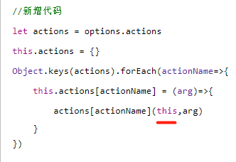
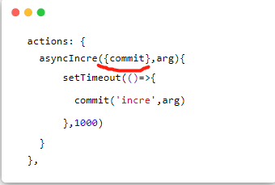
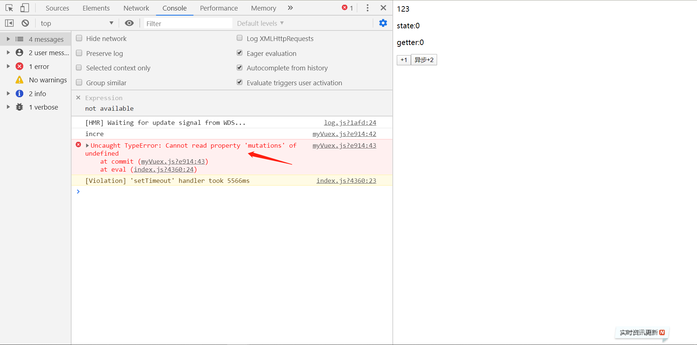
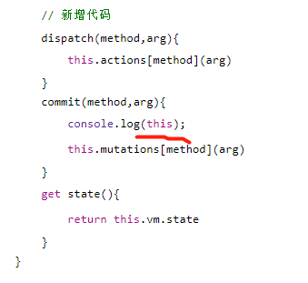

# 实现actions

当会实现mutations后，那actions的实现也很简单，很类似，不信看代码：

```js
    class Store{
        construtor(options){
            this.vm = new Vue({
                data:{
                    state:options.state
                }
            });
        }

        // 实现 getters
        const getters = options.getters || {};
        this.getters = {};
        Object.keys(getters).forEach(getterName => {
            Object.defineProperty(this.getters,getterName,{
                get:()=>{
                    return getters[getterName](this.state);
                }
            });
        });

        // 实现 mutations
        const mutations = options.mutations || {};
        this.mutations = {};
        Object.keys(mutations).forEach(mutatioName => {
            this.mutations[mutationName]=(...args)=>{
                mutations[mutatonName](this.state, ...args);
            }
        });

        // 实现 actions
        const actions = optiosn.actions || {};
        this.actions = {};
        Object.keys(actions).forEach(actionName => {
            this.actions[actionName]=(...args)=>{
                actions[actionName](this, ...args);
            }
        })


        get state(){
            return this.vm.state
        }

        commit(mutationName,...args){
            this.mutations[mutationName](this.state,...args);
        }

        dispatch(actionName,...args){
            this.actions(actionName)(...args);
        }


    }
```

一毛一样，不过有一点需要解释下，就是这里为什么是传this进去。<font color="red">`这个this代表的就是store实例本身`</font>



这是因为我们使用actions是这样使用的：

```js
  actions: {
    asyncIncre({commit},arg){
        setTimeout(()=>{
          commit('incre',arg)
        },1000)
    }
  },
```



其实{commit} 就是对this，即store实例的解构 。
那我们来测试一下。

```html
<template>
  <div id="app">
    123
    <p>state:{{this.$store.state.num}}</p>
    <p>getter:{{this.$store.getters.getNum}}</p>
    <button @click="add">+1</button>
    <button @click="asyncAdd">异步+2</button>
  </div>
</template>

<script>
  export default {
      methods:{
          add(){
              this.$store.commit('incre',1)
          },
          asyncAdd(){
              this.$store.dispatch('asyncIncre',2)
          }
      }
  }
</script>
```

store/index.js

```js
//store/index.js
import Vue from 'vue'
import Vuex from './myVuex'

Vue.use(Vuex)

export default new Vuex.Store({
  state: {
    num:0
  },
  getter:{
    getNum:(state)=>{
      return state.num
    }
  },
  mutations: {
    incre(state,arg){
        state.num += arg
    }
  },
  //新增测试代码
  actions: {
    asyncIncre({commit},arg){
        setTimeout(()=>{
          commit('incre',arg)
        },1000)
    }
  },
})
```



oh my god，居然出错了，它这里错误 说的是执行到这里发现这里的this为undefined。



不过，不对啊，我们在实现mutation的时候也执行到这里了啊，而且执行成功了啊。

来分析一下：

```js
this.$store.commit('incre',1)
```

执行这段代码的时候，执行commit的时候，this是谁调用就指向谁，所以this指向$store。

```js
this.$store.dispatch('asyncIncre',2);
```

执行这段代码，就会执行

```js
asyncIncre({commit},arg){
    setTimeout(()=>{
      commit('incre',arg)
    },1000)
}
```

发现问题了吧？？ 谁调用commit？？是$store吗？并不是。所以要解决这个问题，我们必须换成箭头函数

```js
//myVuex.js
class Store{
    constructor(options) {
        this.vm = new Vue({
            data:{
                state:options.state
            }
        })

        let getters = options.getter || {}
        this.getters = {}
        Object.keys(getters).forEach(getterName=>{
            Object.defineProperty(this.getters,getterName,{
                get:()=>{
                    return getters[getterName](this.state)
                }
            })
        })

        let mutations = options.mutations || {}
        this.mutations = {}
        Object.keys(mutations).forEach(mutationName=>{
            this.mutations[mutationName] =  (arg)=> {
                mutations[mutationName](this.state,arg)
            }
        })

        let actions = options.actions
        this.actions = {}
        Object.keys(actions).forEach(actionName=>{
            this.actions[actionName] = (arg)=>{
                actions[actionName](this,arg)
            }
        })

    }
    dispatch(method,arg){
        this.actions[method](arg)
    }
    // 修改代码
    commit=(method,arg)=>{
        console.log(method);
        console.log(this.mutations);
        this.mutations[method](arg)
    }
    get state(){
        return this.vm.state
    }
}
```

>补充:有群友问到一个问题，我觉得很有意思，就是说直接通过$store.state.xx = ""。可以吗？其实这样赋值也不会有问题，而且state依旧是响应式的。那么为什么用commit来多此一举呢？

**vuex能够记录每一次state的变化记录，保存状态快照，实现时间漫游／回滚之类的操作。**

我有想到一件有意思的事情，要是说我们要实现一个最简单的Vuex，其实只实现state不就好了，其他的getter啊，action，commit都不实现。有种轻装上阵的感觉。其实也能实现。
而这样实现后发现其实跟全局变量差不多，只不过state是响应式的。


`以上内容转自掘进社区"阳光是sunny"的文章`