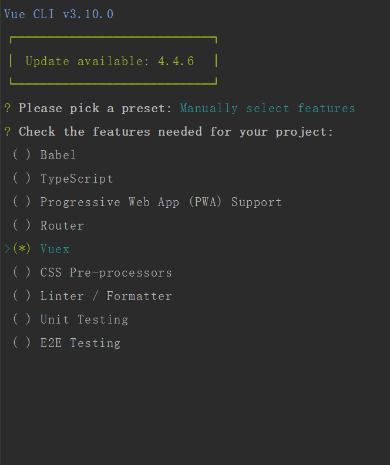
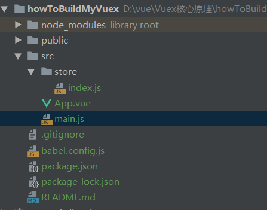
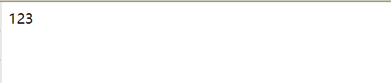
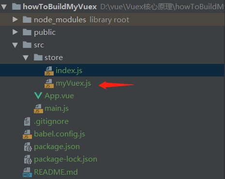

# Vuex的核心原理

1. Vuex本质是一个对象
2. Vuex对象有两个属性，一个是install方法，一个是Store这个类
3. install方法的作用是将store这个实例挂载到所有的组件上，注意是同一个store实例。
3. Store这个类拥有commit，dispatch这些方法，Store类里将用户传入的state包装成data，作为new Vue的参数，从而实现了state 值的响应式。

## 基本准备工作

我们先利用vue-cli建一个项目



删除一些不必要的组建后项目目录暂时如下：



我们主要看下App.vue,main.js,store/index.js

代码如下:

App.vue

```xml
<template>
  <div id="app">
    123
  </div>
</template>
```

store/index.js

```js
import Vue from 'vue'
import Vuex from 'vuex'

Vue.use(Vuex)

export default new Vuex.Store({
  state: {
  },
  mutations: {
  },
  actions: {
  },
  modules: {
  }
})
```

main.js

```js
import Vue from 'vue'
import App from './App.vue'
import store from './store'

Vue.config.productionTip = false

new Vue({
  store,
  render: h => h(App)
}).$mount('#app')
```

现在我们启动一下项目。看看项目初始化有没有成功。



ok，没毛病，初始化成功。

现在我们决定创建自己的Vuex，于是创建myVuex.js文件

目前目录如下



再将Vuex引入 改成我们的myVuex

```js
//store/index.js
import Vue from 'vue'
import Vuex from './myVuex' //修改代码

Vue.use(Vuex)

export default new Vuex.Store({
  state: {
  },
  mutations: {
  },
  actions: {
  },
  modules: {
  }
});
```

`以上内容转自掘进社区"阳光是sunny"的文章`