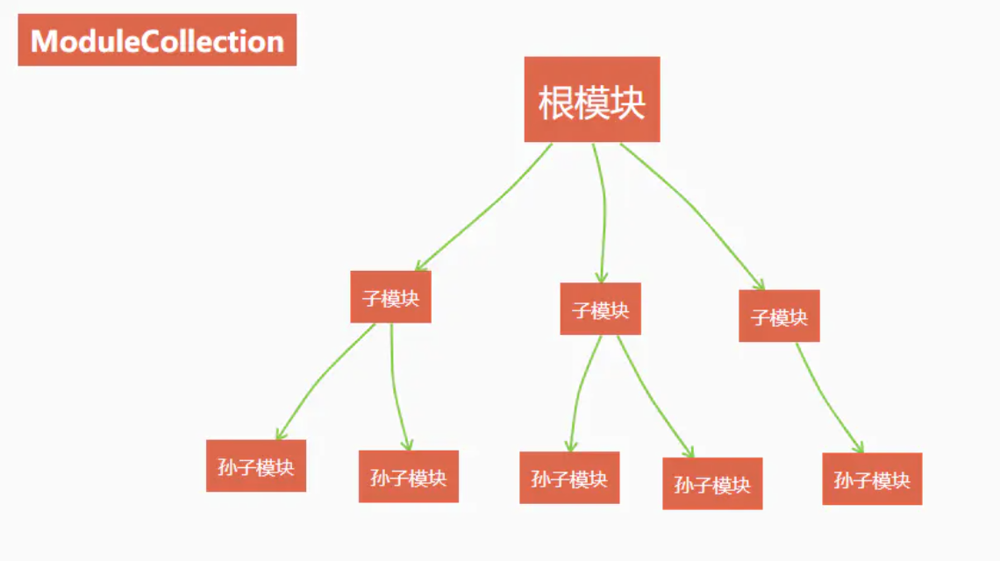

# 实例化 Store

Vuex 所有的行为都是围绕 new Vuex.Store 生成的 store 实例展开的，在实例化 Store 的过程中，主要做了三件事

1. 初始化模块
2. 安装模块
3. 创建一个管理所有数据的 Vue 实例

## 初始化模块

我们知道，Vuex 是支持模块嵌套的，即在一个 Vuex 模块内部，可以通过 modules 属性嵌套子模块，从而形成一个树形的结构，通过模块的划分可以在复杂的情况更好的管理模块，Vuex 将这个树形结构的模块保存在 store 实例的 _modules 属性中

```js
this._modules = new ModuleCollection(options)
```



ModuleCollection 的实例代表了所有模块的集合，即这个树形结构，我称之为模块树，它在实例化时会调用 register 方法，注册所有模块

```js
register(path, rowModule, runtime=true){
    const newModule = new Module(rawModule, runtime);
    if(path.length === 0){
        this.root = newModule;
    }else{
        const parent = this.get(path.slice(0, 1));

        parent.addChild(path[path.length-1], newModule);
    }

    if(rawModule.modules){
        forEach(rawModule.modules, (rawChildModule, key)=>{
            this.register(path.concat(key), rawChildModule, runtime);
        })
    }
}
```

rawModule 即 new Vuex.Store 传入的模块配置项，包括根模块在内，每个模块都是 Module 的一个实例，将第一次调用 `register` 方法传入的模块作为 root 根模块，之后会遍历 modules 对象，递归调用 register 注册子模块

这里有个非常重要的参数，即 path ，它是一个数组，第一次调用 `register` 时， path 是一个空数组，每当递归调用时，会将 path 拼接当前子模块的属性名，举个例子

```js
export default new Vuex.Store({
  // 根模块
  modules: {
    // 子模块A
    moduleA: {
      actions: {
        action(context) {context.commit('mutation')},
      },
      mutations: {
        mutation() {}
      },
      
      modules: {
        // 孙子模块B
        moduleB: {
          actions: {
            action(context) {context.commit('mutation')},
          },
          mutations: {
            mutation() {}
          },
        }
        
      }
    },
  }
})
```

在子模块 moduleA中，path 的值为 ["moduleA"]，而对于孙子模块 moduleB，path 的值为 ["moduleA,"moduleB"]，有了这样的层级关系，就可以通过 path 数组很好的找到对应的模块

`作者：yeyan1996
链接：https://juejin.cn/post/6844903874734620680
来源：掘金
著作权归作者所有。商业转载请联系作者获得授权，非商业转载请注明出处`