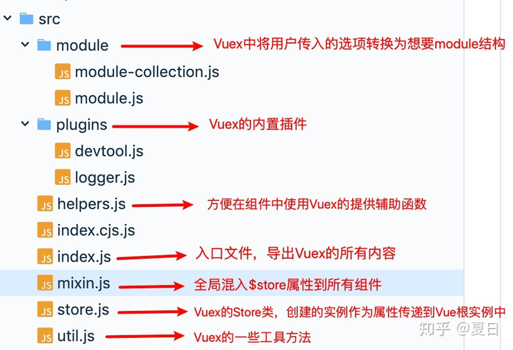
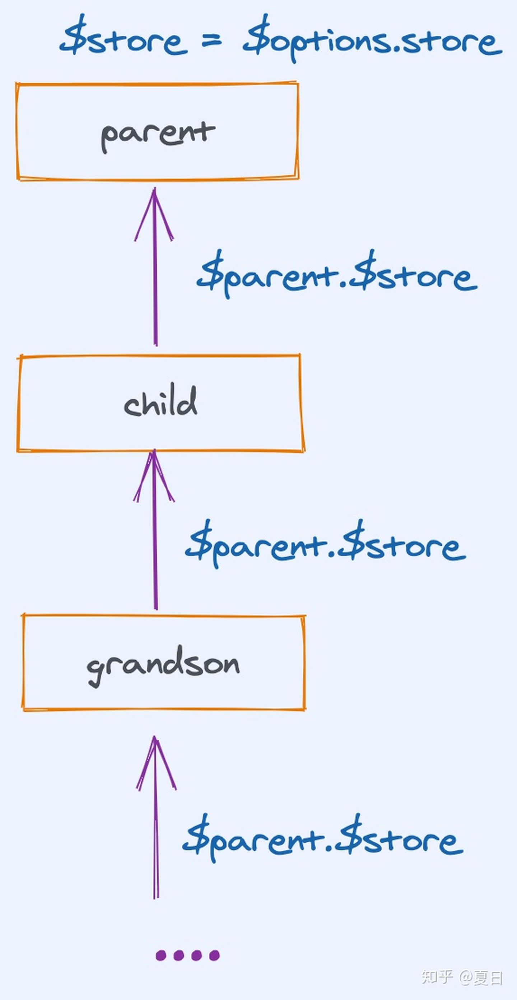

# `Vuex` 源码目录结构



>下面我们只摘出源码中的核心代码进行解读，具体细节需要读者去源码中寻找

## 所有组件都可以访问`$store`

源码中的`install`方法与我们的实现基本上是相同的，代码如下：

```js
// store.js
export function install (_Vue) {
  Vue = _Vue
  applyMixin(Vue)
}

// mixin
export default function applyMixin (Vue) {
  Vue.mixin({ beforeCreate: vuexInit })
  /**
   * Vuex init hook, injected into each instances init hooks list.
   */
  function vuexInit () {
    const options = this.$options
    // store injection
    // 自上而下将根实例中传入的VuexStore实例store注入到所有组件的实例上
    if (options.store) {
      this.$store = typeof options.store === 'function'
        ? options.store()
        : options.store
    } else if (options.parent && options.parent.$store) {
      this.$store = options.parent.$store
    }
  }
}
```



子组件在调用`beforeCreate`函数时，都会使用其父组件的`$store`属性作为自己的`$store`属性，而根实例会在实例化时我们手动传入`store`属性。这样使每个组件都拥有了`$store`属性

## 依赖收集

在`Vuex`中可以将`state,actions,mutatoins`等属性根据模块`modules`进行划分，方便代码的维护。当然这会生成一个递归的树形结构对象，下面我们看看`Vuex`如何优雅的处理递归树形结构数据。

在`Store`拿到了用户传入的配置项之后，首先进行的操作是模块收集，其目的是将用户传入的配置项处理为更加方便的树形结构


