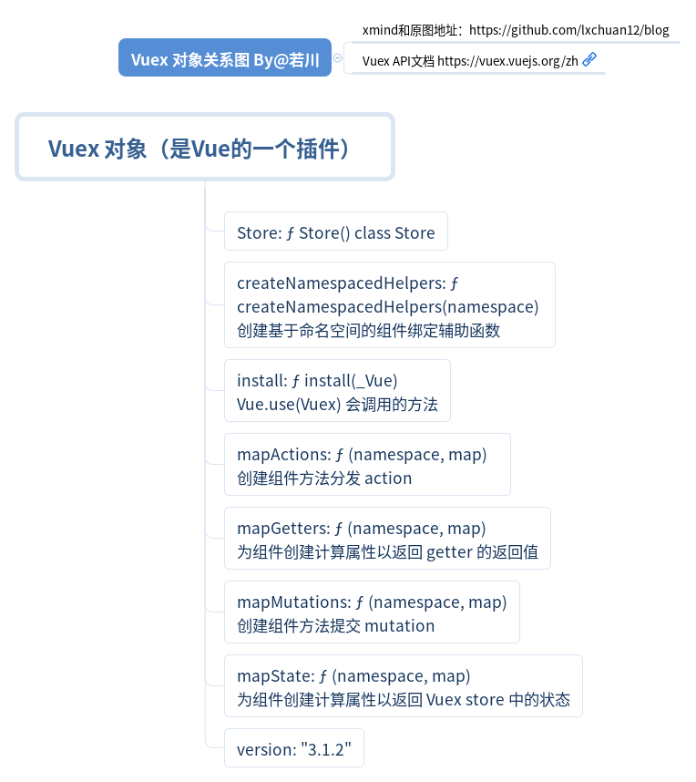

# Vue.use 安装



`Vue.use(Vuex)`

>参数：Object  Function plugin
>
>用法：安装 Vue.js 插件。如果插件是一个对象，必须提供 install 方法。如果插件是一个函数，它会被作为 install 方法。install 方法调用时，会将 Vue 作为参数传入。
>
>该方法需要在调用 new Vue() 之前被调用。
>
>当 install 方法被同一个插件多次调用，插件将只会被安装一次。

根据断点调试，来看下`Vue.use`的源码。

```js
function initUse (Vue) {
  Vue.use = function (plugin) {
    var installedPlugins = (this._installedPlugins || (this._installedPlugins = []));
    // 如果已经存在，则直接返回this也就是Vue
    if (installedPlugins.indexOf(plugin) > -1) {
      return this
    }

    // additional parameters
    var args = toArray(arguments, 1);
    // 把 this（也就是Vue）作为数组的第一项
    args.unshift(this);
    // 如果插件的install属性是函数,调用它
    if (typeof plugin.install === 'function') {
      plugin.install.apply(plugin, args);
    } else if (typeof plugin === 'function') {
      // 如果插件是函数,则调用它
      // apply(null) 严格模式下 plugin 插件函数的 this 就是 null
      plugin.apply(null, args);
    }
    // 添加到已安装的插件
    installedPlugins.push(plugin);
    return this
  };
}
```

## install 函数

`vuex/src/store.js`

```js
export function install (_Vue) {
  // Vue 已经存在并且相等，说明已经Vuex.use过
  if (Vue && _Vue === Vue) {
    // 省略代码：非生产环境报错，vuex已经安装
    return
  }
  Vue = _Vue
  applyMixin(Vue)
}
```

接下来看 `applyMixin` 函数

## applyMixin 函数

`vuex/src/mixin.js`

```js
export default function (Vue) {
  // Vue 版本号
  const version = Number(Vue.version.split('.')[0])
  if (version >= 2) {
    // 合并选项后 beforeCreate 是数组里函数的形式  [ƒ,  ƒ]
    // 最后调用循环遍历这个数组，调用这些函数，这是一种函数与函数合并的解决方案。
    // 假设是我们自己来设计，会是什么方案呢。
    Vue.mixin({ beforeCreate: vuexInit })
  } else {
    // 省略1.x的版本代码 ...
  }

  /**
   * Vuex init hook, injected into each instances init hooks list.
   */
  function vuexInit () {
    const options = this.$options
    // store injection
    // store 注入到每一个Vue的实例中
    if (options.store) {
      this.$store = typeof options.store === 'function'
        ? options.store()
        : options.store
    } else if (options.parent && options.parent.$store) {
      this.$store = options.parent.$store
    }
  }
}
```

最终每个Vue的实例对象，都有一个$store属性。且是同一个Store实例。
用购物车的例子来举例就是：

```js
const vm = new Vue({
  el: '#app',
  store,
  render: h => h(App)
})
console.log('vm.$store === vm.$children[0].$store', vm.$store === vm.$children[0].$store)
// true
console.log('vm.$store === vm.$children[0].$children[0].$store', vm.$store === vm.$children[0].$children[0].$store)
// true
console.log('vm.$store === vm.$children[0].$children[1].$store', vm.$store === vm.$children[0].$children[1].$store)
// true
```

`内容节自掘进社区"若川"的文章, 仅用于个人学习`


