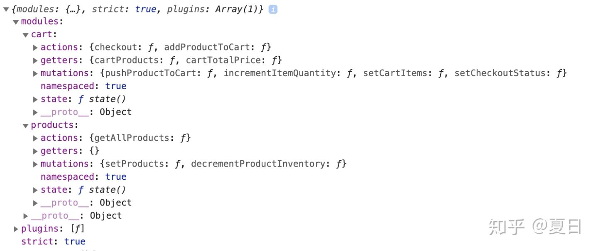
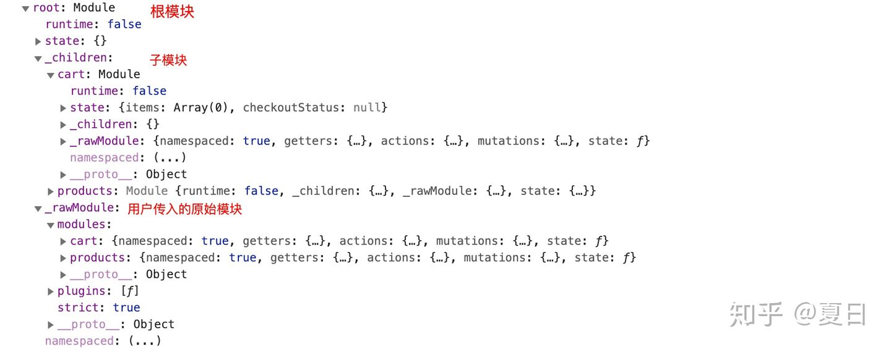

## 依赖收集

在`Vuex`中可以将`state,actions,mutatoins`等属性根据模块`modules`进行划分，方便代码的维护。当然这会生成一个递归的树形结构对象，下面我们看看`Vuex`如何优雅的处理递归树形结构数据。

在`Store`拿到了用户传入的配置项之后，首先进行的操作是模块收集，其目的是将用户传入的配置项处理为更加方便的树形结构

用户传入：



处理之后：



```js
// store.js
export class Store {
  constructor (options = {}) {
      // some code ...
      this._modules = new ModuleCollection(options);
      // some code ...
    }
}

// module-collection.js
export default class ModuleCollection {
  constructor (rawRootModule) {
    // register root module (Vuex.Store options)
    this.register([], rawRootModule, false)
  }

  register (path, rawModule, runtime = true) {
    // 格式化用户配置项，并为每个模块原型上添加一些公有方法，方便调用
    const newModule = new Module(rawModule, runtime);
    // 处理根模块
    if (path.length === 0) {
      this.root = newModule;
    } else { // 处理子模块
      // 通过path找到父模块
      const parent = this.get(path.slice(0, -1));
      // 将父模块的子模块赋值为当前遍历的模块，key为path的最后一项
      parent.addChild(path[path.length - 1], newModule);
      // parent._children[path[path.length-1]] = newModule
    }

    // register nested modules
    if (rawModule.modules) { // 递归处理子模块
      forEachValue(rawModule.modules, (rawChildModule, key) => {
        this.register(path.concat(key), rawChildModule, runtime);
      });
    }
  }
}
```

到这里我们将配置项处理为了比较方便的结构,并且每个模块也通过Module类提供了一些原型方法方便直接调用：

```js
{ 
  root:{
    state: {},
    _children:{},
    _rawModule: {},
    __proto__: {
      addChild: f,
      forEachMutation: f,
      forEachAction: f,
      ...
    }
  },
}
```