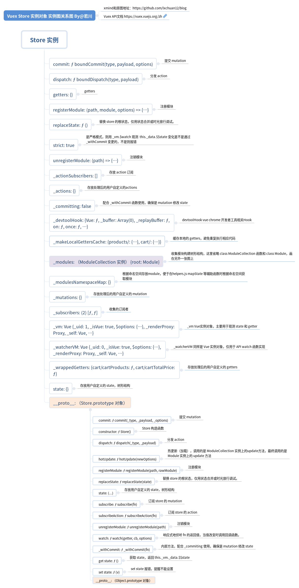
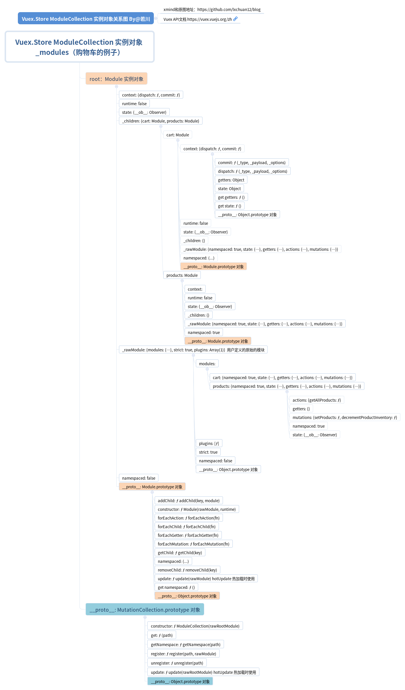

# Vuex.Store 构造函数

先看最终 `new Vuex.Store` 之后的 `Store` 实例对象关系图：先大致有个印象。



```js
export class Store {
  constructor (options = {}) {
    // 这个构造函数比较长，这里省略，后文分开细述
  }
}
```

```js
if (!Vue && typeof window !== 'undefined' && window.Vue) {
  install(window.Vue)
}        
```

如果是 `cdn script` 方式引入`vuex`插件，则自动安装`vuex`插件，不需要用`Vue.use(Vuex)`来安装。

条件断言：不满足直接抛出错误

>1. 必须使用 Vue.use(Vuex) 创建 store 实例。
>2. 当前环境不支持Promise，报错：vuex 需要 Promise polyfill。
>3. Store 函数必须使用 new 操作符调用。

```js
if (process.env.NODE_ENV !== 'production') {
  // 可能有读者会问：为啥不用 console.assert，console.assert 函数报错不会阻止后续代码执行
  assert(Vue, `must call Vue.use(Vuex) before creating a store instance.`)
  assert(typeof Promise !== 'undefined', `vuex requires a Promise polyfill in this browser.`)
  assert(this instanceof Store, `store must be called with the new operator.`)
}

// asset 函数实现
export function assert (condition, msg) {
  if (!condition) throw new Error(`[vuex] ${msg}`)
}
```

从用户定义的new Vuex.Store(options) 取出plugins和strict参数。

```js
const {
  // 插件默认是空数组
  plugins = [],
  // 严格模式默认是false
  strict = false
} = options
```

声明`Store`实例对象一些内部变量。用于存放处理后用户自定义的`actions、mutations、getters`等变量。

```js
// store internal state
// store 实例对象 内部的 state
this._committing = false

// 用来存放处理后的用户自定义的actoins
this._actions = Object.create(null)
// 用来存放 actions 订阅
this._actionSubscribers = []

// 用来存放处理后的用户自定义的mutations
this._mutations = Object.create(null)

// 用来存放处理后的用户自定义的 getters
this._wrappedGetters = Object.create(null)

// 模块收集器，构造模块树形结构
this._modules = new ModuleCollection(options)
// 用于存储模块命名空间的关系
this._modulesNamespaceMap = Object.create(null)

// 订阅
this._subscribers = []
// 用于使用 $watch 观测 getters
this._watcherVM = new Vue()

// 用来存放生成的本地 getters 的缓存
this._makeLocalGettersCache = Object.create(null)
```

>提一下 Object.create(null) 和 {} 的区别。前者没有原型链，后者有。 即 Object.create(null).__proto__是 undefined ({}).__proto__ 是 Object.prototype

给自己绑定 commit 和 dispatch

```js
// bind commit and dispatch to self
const store = this
const { dispatch, commit } = this
this.dispatch = function boundDispatch (type, payload) {
  return dispatch.call(store, type, payload)
}
this.commit = function boundCommit (type, payload, options) {
  return commit.call(store, type, payload, options)
}
```
>为何要这样绑定?\
>说明调用 `commit `和 `dispach` 的 `this` 不一定是 `store` 实例\
>这是确保这两个函数里的 `this` 是 `store` 实例

```js
// 严格模式，默认是false
this.strict = strict
// 根模块的state
const state = this._modules.root.state

// init root module.
// this also recursively registers all sub-modules
// and collects all module getters inside this._wrappedGetters
installModule(this, state, [], this._modules.root)

// initialize the store vm, which is responsible for the reactivity
// (also registers _wrappedGetters as computed properties)
resetStoreVM(this, state)
```
上述这段代码 `installModule(this, state, [], this._modules.root)`

>初始化根模块。\
>并且也递归的注册所有子模块。\
>并且收集所有模块的`getters`放在`this._wrappedGetters`里面。

`resetStoreVM(this, state)`

>初始化 `store._vm` 响应式的 \
>并且注册 `_wrappedGetters` 作为 `computed` 的属性

```js
plugins.forEach(plugin => plugin(this))
```

插件：把实例对象`store`传给插件函数，执行所有插件。

```js
const useDevtools = options.devtools !== undefined 
    ? options.devtools 
    : Vue.config.devtools
if (useDevtools) {
  devtoolPlugin(this)
}
```

初始化`vue-devtool`开发工具。
参数`devtools`传递了取`devtools`否则取`Vue.config.devtools`配置。

初读这个构造函数的全部源代码。会发现有三个地方需要重点看。分别是：

```js
this._modules = new ModuleCollection(options)
installModule(this, state, [], this._modules.root)
resetStoreVM(this, state)
```

阅读时可以断点调试，赋值语句`this._modules = new ModuleCollection(options)`，如果暂时不想看，可以直接看返回结果。`installModule，resetStoreVM`函数则可以断点调试。

## class ModuleCollection

收集模块，构造模块树结构。

>注册根模块 参数 rawRootModule 也就是 Vuex.Store 的 options 参数\
>未加工过的模块（用户自定义的），根模块

```js
export default class ModuleCollection {
  constructor (rawRootModule) {
    // register root module (Vuex.Store options)
    this.register([], rawRootModule, false)
  }

  /**
  * 注册模块
  * @param {Array} path 路径
  * @param {Object} rawModule 原始未加工的模块
  * @param {Boolean} runtime runtime 默认是 true
  */
  register (path, rawModule, runtime = true) {
    // 非生产环境 断言判断用户自定义的模块是否符合要求
    if (process.env.NODE_ENV !== 'production') {
      assertRawModule(path, rawModule)
    }

    const newModule = new Module(rawModule, runtime)
    if (path.length === 0) {
      this.root = newModule
    } else {
      const parent = this.get(path.slice(0, -1))
      parent.addChild(path[path.length - 1], newModule)
    }

    // register nested modules
    // 递归注册子模块
    if (rawModule.modules) {
      forEachValue(rawModule.modules, (rawChildModule, key) => {
        this.register(path.concat(key), rawChildModule, runtime)
      })
   }
  }
}
```

### class Module

```js
// Base data struct for store's module, package with some attribute and method
// store 的模块 基础数据结构，包括一些属性和方法
export default class Module {
  constructor (rawModule, runtime) {
    // 接收参数 runtime
    this.runtime = runtime
    // Store some children item
    // 存储子模块
    this._children = Object.create(null)
    // Store the origin module object which passed by programmer
    // 存储原始未加工的模块
    this._rawModule = rawModule
    // 模块 state
    const rawState = rawModule.state

    // Store the origin module's state
    // 原始Store 可能是函数，也可能是是对象，是假值，则赋值空对象。
    this.state = (typeof rawState === 'function' ? rawState() : rawState) || {}
  }
}
```

经过一系列的注册后，最后 `this._modules = new ModuleCollection(options) this._modules` 的值是这样的。 笔者画了一张图表示：



### installModule 函数

```js
function installModule (store, rootState, path, module, hot) {
  // 是根模块
  const isRoot = !path.length
  // 命名空间 字符串
  const namespace = store._modules.getNamespace(path)
  if (module.namespaced) {
    // 省略代码： 模块命名空间map对象中已经有了，开发环境报错提示重复
    // module 赋值给 _modulesNamespaceMap[namespace]
    store._modulesNamespaceMap[namespace] = module
  }
  // ... 后续代码 移出来 待读解释
}
```

#### 注册 state

```js
// set state
// 不是根模块且不是热重载
if (!isRoot && !hot) {
  // 获取父级的state
  const parentState = getNestedState(rootState, path.slice(0, -1))
  // 模块名称
  // 比如 cart
  const moduleName = path[path.length - 1]
  // state 注册
  store._withCommit(() => {
    // 省略代码：非生产环境 报错 模块 state 重复设置
    Vue.set(parentState, moduleName, module.state)
  })
}
```

最后得到的是类似这样的结构且是响应式的数据 实例 Store.state 比如：

```js
{
  // 省略若干属性和方法
  // 这里的 state 是只读属性 可搜索 get state 查看，上文写过
  state: {
    cart: {
      checkoutStatus: null,
      items: []
    }
 }
}
```

```js
const local = module.context = makeLocalContext(store, namespace, path)
```

>module.context 这个赋值主要是给 helpers 中 mapState、mapGetters、mapMutations、mapActions四个辅助函数使用的。\
>生成本地的dispatch、commit、getters和state。\
>主要作用就是抹平差异化，不需要用户再传模块参数。

#### 遍历注册 mutation

```js
module.forEachMutation((mutation, key) => {
  const namespacedType = namespace + key
  registerMutation(store, namespacedType, mutation, local)
})

/**
 * 注册 mutation
 * @param {Object} store 对象
 * @param {String} type 类型
 * @param {Function} handler 用户自定义的函数
 * @param {Object} local local 对象
 */
function registerMutation (store, type, handler, local) {
  // 收集的所有的mutations找对应的mutation函数，没有就赋值空数组
  const entry = store._mutations[type] || (store._mutations[type] = [])
  // 最后 mutation
  entry.push(function wrappedMutationHandler (payload) {
    /**
     * mutations: {
     *    pushProductToCart (state, { id }) {
     *        console.log(state);
     *    }
     * }
     * 也就是为什么用户定义的 mutation 第一个参数是state的原因，第二个参数是payload参数
     */
    handler.call(store, local.state, payload)
  })
}

```

`内容节自掘进社区"若川"的文章, 仅用于个人学习`